<a id="readme-top"></a>

<!-- PROJECT LOGO -->
<br />
<div align="center">
<h3 align="center">AMPOLA</h3>

  <p align="center">
    Virtual machine manager with <a href="https://www.virtualbox.org/wiki/Linux_Downloads">Virtualbox</a> and <a href="https://guacamole.apache.org/">Guacamole</a>
    <br />
    <a href="https://github.com/ludersGabriel/tcc"><strong>Explore the codebase »</strong></a>
    <br />
    <br />
    <!-- <a href="https://github.com/ludersGabriel/tcc">View Demo</a>
    ·
    <a href="https://github.com/ludersGabriel/tcc/issues/new?labels=bug&template=bug-report---.md">Report Bug</a>
    ·
    <a href="https://github.com/ludersGabriel/tcc/issues/new?labels=enhancement&template=feature-request---.md">Request Feature</a>
  </p> -->
</div>


<!-- TABLE OF CONTENTS -->
<details>
  <summary>Table of Contents</summary>
  <ol>
    <li>
      <a href="#about-the-project">About The Project</a>
      <ul>
        <li><a href="#built-with">Built With</a></li>
      </ul>
    </li>
    <li>
      <a href="#getting-started">Getting Started</a>
      <ul>
        <li><a href="#prerequisites">Prerequisites</a></li>
        <li><a href="#installation">Installation</a></li>
        <li><a href="#running">Running</a></li>
      </ul>
    </li>
    <li><a href="#usage">Usage</a></li>
    <li><a href="#contact">Contact</a></li>
  </ol>
</details>


<!-- ABOUT THE PROJECT -->
## About The Project

This is a proof of concept of a virtual machine manager on the web to accelerate and facilitate the process of creating controlled systems for malware analysis and access to these environments.

It was mainly tested using [Ubuntu 24.04][Ubuntu-url] and [Ubuntu 20.04][Ubuntu-2004-url] and it uses [Virtualbox][Virtualbox-url] for the orchestration of the virtual machines and [Guacamole][Guac-url] with VRDP to connect to the virtual machines through the web.

Also, the machine it was mainly tested on has the following specs:

* Architecture:             x86_64
  - CPU op-mode(s):         32-bit, 64-bit
  - Address sizes:          48 bits physical, 48 bits virtual
  - Byte Order:             Little Endian
* CPU(s):                   16
  - On-line CPU(s) list:    0-15
* Vendor ID:                AuthenticAMD
  - Model name:             AMD Ryzen 7 5800H with Radeon 
* Memory: 32 GB

<p align="right">(<a href="#readme-top">back to top</a>)</p>

### Built With

* [![Vite][Vite]][Vite]
* [![React][React.js]][React-url]
* [![NodeJS][NodeJS]][Node-url]
* [![Postgres][Postgres]][Postgres-url]
* [![Docker][Docker]][Docker-url]

<p align="right">(<a href="#readme-top">back to top</a>)</p>

<!-- GETTING STARTED -->
## Getting Started

Here you will find instructions on how to get a local version running on [Ubuntu 24.04][Ubuntu-url], the LTS version of Ubuntu at the time this README was written.

### Prerequisites

* [Download and install Ubuntu 24.04](https://ubuntu.com/download/desktop)

* Node
  ```sh
  # installs nvm (Node Version Manager)
  curl -o- https://raw.githubusercontent.com/nvm-sh/nvm/v0.39.7/install.sh | bash

  # download and install Node.js (you may need to restart the terminal)
  nvm install 20.15.0

  # verifies the right Node.js version is in the environment
  node -v # should print `v20.15.0`

  # verifies that npm has been installed
  npm -v
  ```

* Download and install [Docker](https://docs.docker.com/engine/install/ubuntu/) for ubuntu 24.04

* Download and install [Virtualbox](https://download.virtualbox.org/virtualbox/7.0.18/virtualbox-7.0_7.0.18-162988~Ubuntu~noble_amd64.deb) for ubuntu 24.04:

  ```sh
    # to get C and kernel building functionalities necessary for vbox
    sudo apt-get install build-essential 
    
    # download virtualbox version
    sudo dpkg -i ~/Downloads/virtualbox-7.0_7.0.18-162988~Ubuntu~noble_amd64.deb 

    # Get the missing dependencies shown by dpkg
    sudo apt --fix-broken install 

    # to reconfigure vbox after fixing the missing dependencies
    sudo /sbin/vboxconfig 
  ```

  and the [virtualbox extensions pack](https://download.virtualbox.org/virtualbox/7.0.18/Oracle_VM_VirtualBox_Extension_Pack-7.0.18.vbox-extpack) that is needed so we can have VRDP access to the virtual machines

  ```sh
    # install the extension downloaded above
    virtualbox ~/Downloads/Oracle_VM_VirtualBox_Extension_Pack-7.0.18.vbox-extpack
  ```

* OVAS

  Since the system only manages VMs, there is a need for pre defined OVAS so virtualbox can use them to create the VMs for the users.

  These images also need to have [Virtualbox Guest Additions](https://www.virtualbox.org/manual/ch04.html) so we can control them with [VBoxManage](https://www.virtualbox.org/manual/ch08.html) and, due constraints of the system for file transfer, they need to have a single user that is admin and has no password.

  You can get a kali ova ready to run at [kali.ova](https://www.inf.ufpr.br/gl19/TCC/kali.ova). Important to note that the user in this vm is called `lurdo`. If you use this ova, you will need it later.

### Installation

1. Clone the repo
   ```sh
   git clone https://github.com/ludersGabriel/tcc.git ampola
   cd ampola
   ```
2. Install NPM packages

  * Backend
    ```sh
    cd backend
    npm install
    cd ..
    ```

    Also move or copy your pre-defined OVAS to `backend/src/ovas`

  * Frontend
    ```sh
      cd frontend
      npm install
      cd ..
    ```

<p align="right">(<a href="#readme-top">back to top</a>)</p>

### Running

1. Run the dockers for the database and the guacamole-daemon
  </br>
  Open a new terminal at `ampola` and run: 
   ```sh
    cd backend
    docker compose up
   ```

2. Apply migrations and initial seeds for the database and run 
   the backend:
   </br>
   Open a new terminal at `ampola` and run:
   ```sh
    npm run drizzle:migrate
    npm run drizzle:seed
    npm run dev
   ```

3. Run the frontend
   </br>
   Open a new terminal at `ampola` and run:
   ```sh
    cd frontend
    npm run dev
   ```
4. Access the app at http://localhost:5173/ with
   ```
    login: admin
    password: admin
   ```

Now you should have three terminals: 
  1. one running the guac-daemon and postgresql database within dockers
  2. one running the backend
  3. one running the frontend

and the application accessible through the browser at http://localhost:5173/

<p align="right">(<a href="#readme-top">back to top</a>)</p>


<!-- USAGE EXAMPLES -->
## Usage

If you followed the instructions above, you should be able to connect to the application at http://localhost:5173 with a default user `{user: admin, password: admin}`. 

Also, from the seeds, the system is configured with the default configs for memory management and concurrent vm creation, which are:

```
  total mem usage: 50%
  concurrent vm creation: 2
```

Right now each vm is also given 4GB of RAM hardcoded at `backend/src/scripts/create.sh`.

### Simple HTTP communication

Here you will find a very simple use case using the kali linux ova that was given above and that should be put at `ampola/backend/src/ovas`. The objective is to give you a grasp on how to use this prototype.

***
Note that with the default configs, in order to follow this use case, you need at least 16GB of RAM, since both vms will consume a combined 8GB which is 50% of the total system RAM. You can change these configs at the Admin tab inside the dashboard from within the app.
***

1. When first connecting to http://localhost:5173 you will see:

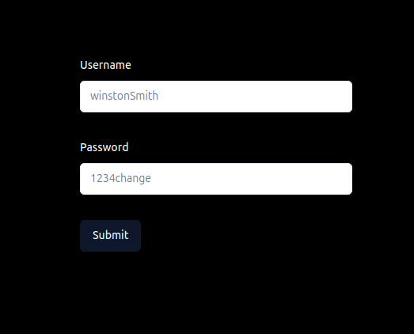

Login with the credentials:
```
login: admin
password: admin
```

1. After a successful login, you should see the dashboard:

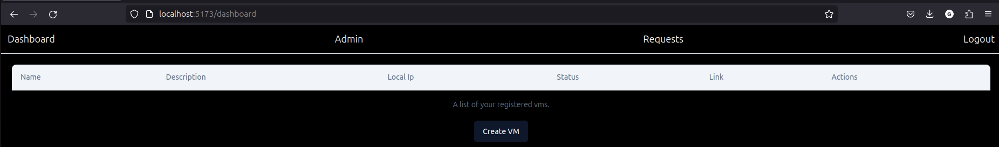

3. Now, click on `Create VM` and fill the form with the following:

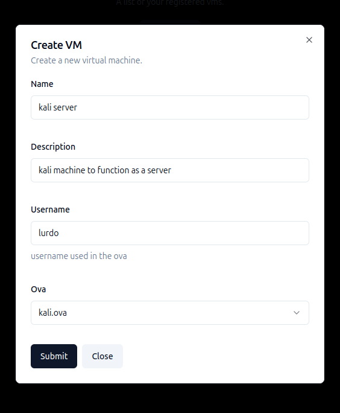

Repeat to create the client:


Some brief explanation of the fields: 
* `Name:` name of the vm you are creating
* `Description:` description of the vm that you are creating
* `Username:` the username for the unique admin account with no password in the ova. For our kali machine, the username is `lurdo`
* `ova:` ova that you are going to use as base to create the vm

4. Now that you issued the requests, since the system needs a little bit of time (around 2 minutes on my machine) to configure the vms, you can check the state of your requests at the `Requests` page from the navbar. You should see something like:

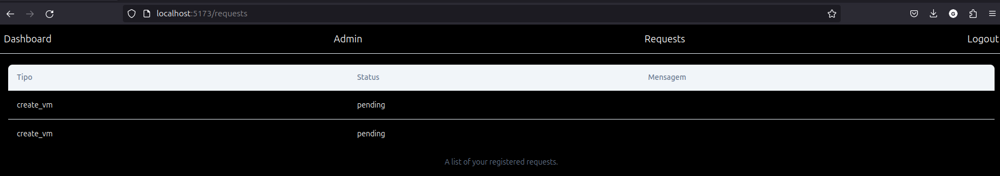

After it's finished processing, you should see:

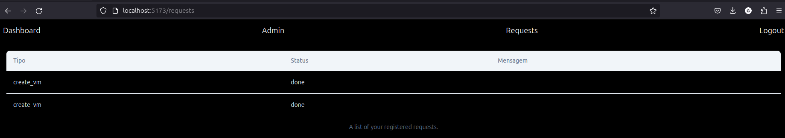

In case of error, it will give you a log of what happened. 

The vms are being created right now with 4096MB (4GB) of ram each and take some disk space too. With this in mind, the most common errors are due to a lack of hardware resources. In the `Admin` tab at the navbar, you can find the default configs that came from the seed command at the instructions:

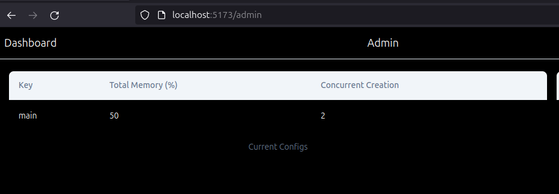

This tells you that it's only allowed to have `2 concurrent machines` being created and that we can only use `50% of the total hardware memory`. Given these parameters, to be able to create both vms successfully, your system requires at least `16GB` of RAM so we can use `4GB` for each machine.

If you want to change the amount of memory given for each machine right now (although not recommended), you can do it at `backend/src/scripts/create.sh` by changing the variable `MEMORY_SIZE=4096  # 4GB`.

5. With the machines successfully created, go back to the `Dashboard` tab from the navbar, where you will find:

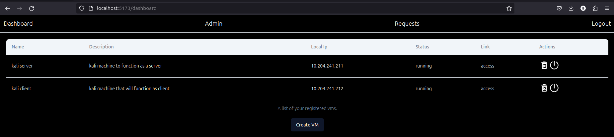

Now, `ctrl + left click` at the `access` of each table to open them in separate tabs. You should find this (Server - Client, from left to right):

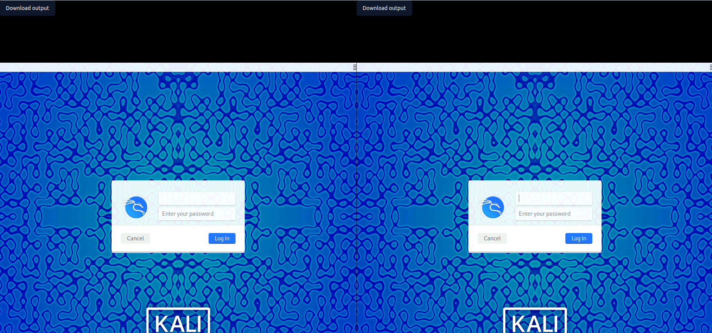

When you see split images, they will have our `kali server` on the left and the `kali client` on the right.

To login, just type `lurdo` in the username, hit `enter` and click `login`.

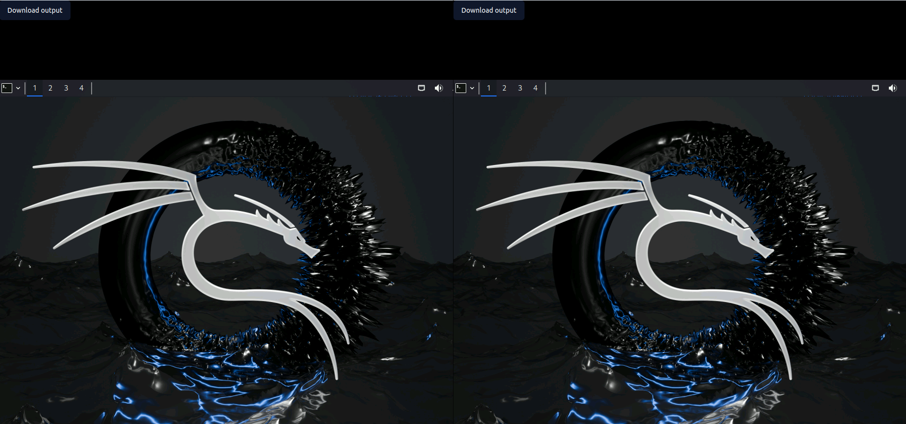

6. Lets put some files in the server so we can get it in our client. 

To do this, in your own machine, outside the vms, type the following at a terminal: `echo "hello from server" > ~/server.text`. Then, open your home folder with the UI from ubuntu, drag and drop the `server.text` file to the browser window containing the server. After, you should see the text file appearing at the desktop of the server just bellow the `Home` folder icon

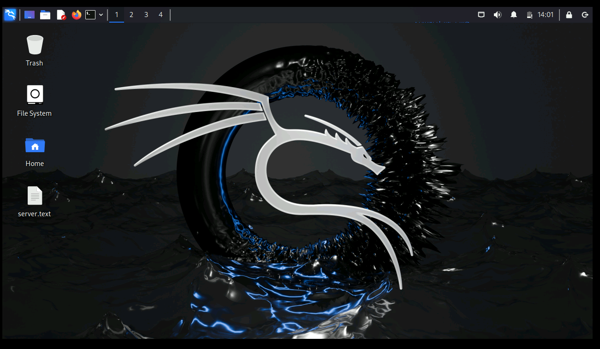

Now, at your server, open a terminal and type:
```
  mkdir server-test
  mv ~/Desktop/server.txt server-test
  cd server-test
  python -m http.server
```

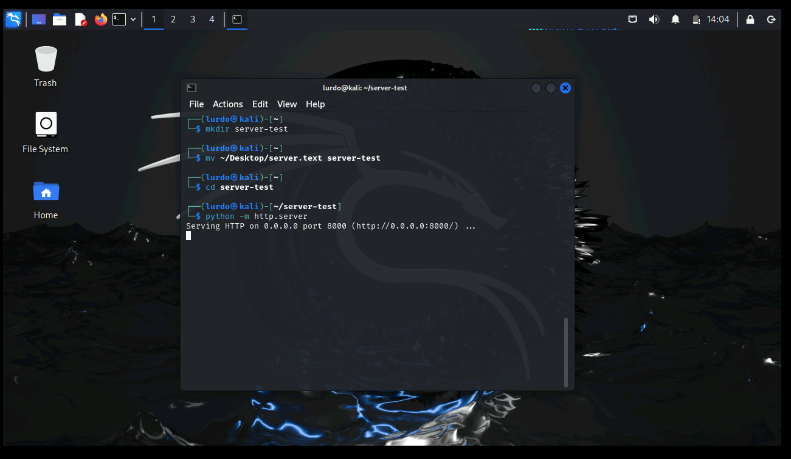

As a final step, just open another terminal, type `ifconfig` and note the `ipv4` (the `inet` value) of your server:

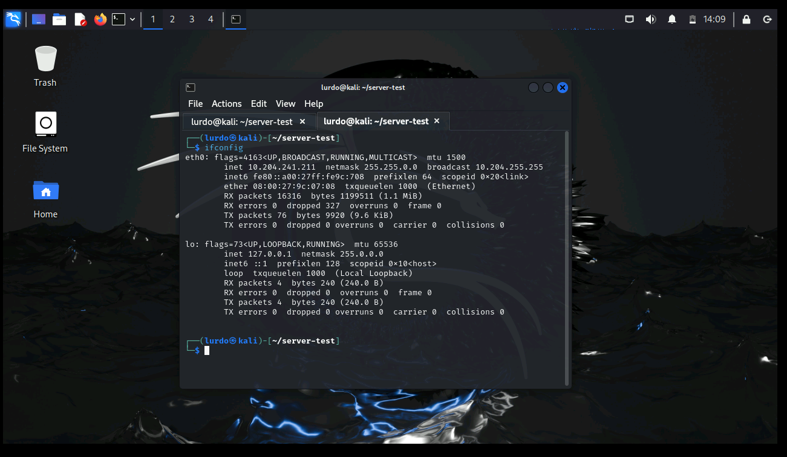

In my case I have `10.204.241.211`. The more observant of you might realize that this is the same ipv4 shown in the table at the dashboard tab where we clicked to access the vm!

Right now, from your machine, you can already go to `http://server_ipv4:8000` and see our file being served!

7. But to show that the vms can communicate, lets download the file through our client kali.

To do this, go to your client kali browser, open a terminal and write the following:

```
  wget http://server_ip:8000/server.text
  ls
  cat server.text
```

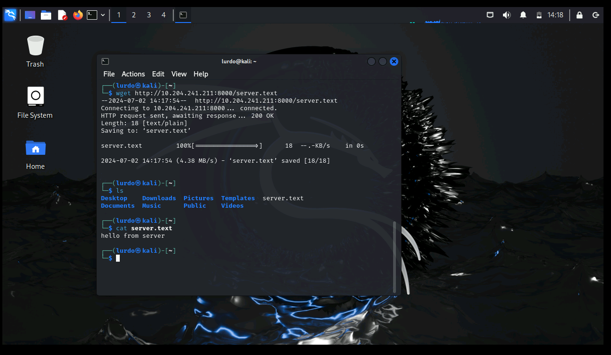

You should see `hello from server` showing that the wget was successful and that the machines can talk to each other!

That's it for this example! You can find some more interesting use cases (although with a little less documentation) at my [Final College Paper][tcc-url]

<p align="right">(<a href="#readme-top">back to top</a>)</p>

<!-- CONTACT -->
## Contact

Gabriel Lüders - ludersdev@gmail.com

Project Link: [https://github.com/ludersGabriel/tcc](https://github.com/ludersGabriel/tcc)

Secret Lab Link: [Secret](https://secret.inf.ufpr.br/) 

<p align="right">(<a href="#readme-top">back to top</a>)</p>

<!-- MARKDOWN LINKS & IMAGES -->
<!-- https://www.markdownguide.org/basic-syntax/#reference-style-links -->
[license-url]: https://github.com/ludersGabriel/tcc/blob/master/LICENSE.txt
[linkedin-shield]: https://img.shields.io/badge/-LinkedIn-black.svg?style=for-the-badge&logo=linkedin&colorB=555
[linkedin-url]: https://linkedin.com/in/gabriel-luders-25bb4620a
[product-screenshot]: images/screenshot.png

[Vite]: https://img.shields.io/badge/vite-%23646CFF.svg?style=for-the-badge&logo=vite&logoColor=white
[Vite-url]: https://vitejs.dev/
[React.js]: https://img.shields.io/badge/React-20232A?style=for-the-badge&logo=react&logoColor=61DAFB
[React-url]: https://reactjs.org/
[NodeJS]: https://img.shields.io/badge/node.js-6DA55F?style=for-the-badge&logo=node.js&logoColor=white
[Node-url]: https://nodejs.org/en
[Postgres]: https://img.shields.io/badge/postgres-%23316192.svg?style=for-the-badge&logo=postgresql&logoColor=white
[Postgres-url]: https://www.postgresql.org/
[Docker]: https://img.shields.io/badge/docker-%230db7ed.svg?style=for-the-badge&logo=docker&logoColor=white
[Docker-url]: https://www.docker.com/

[Guac-url]: https://guacamole.apache.org/
[Virtualbox-url]: https://www.virtualbox.org/wiki/Linux_Downloads

[Ubuntu-url]: https://ubuntu.com/blog/tag/ubuntu-24-04-lts
[Ubuntu-2004-url]: https://releases.ubuntu.com/focal/

[tcc-url]: https://github.com/ludersGabriel/tcc/blob/master/tcc.pdf